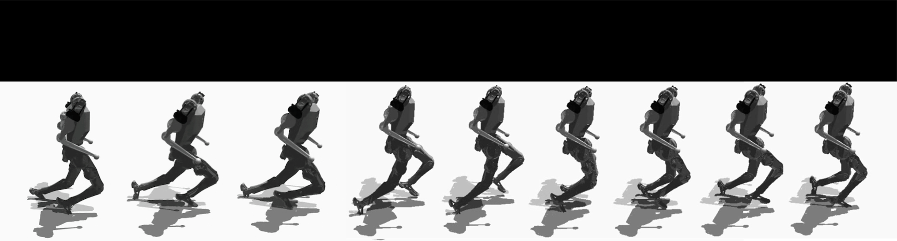

# FYP_ICRL
<p align="center">
  
</p>

The repository is an open-sourced code for the final year project of UESTC, 2025. 

#### Title:  Adaptive Motion Planning and Control for Biped Robots in Dynamic Environments <br/> 

### Installation ###
1. Create a new python virtual env with python 3.8 using Anaconda
   ```bash
   conda create --name mbfp python=3.8
   conda init
   conda activate mbfp
   ```
2. Clone this repo
3. Change source
  `python -m pip install --upgrade pip`
  `pip config set global.index-url https://mirrors.tuna.tsinghua.edu.cn/pypi/web/simple`
4. Install humanoidGym Requirements:
```bash
pip install -r requirements.txt
```
5. Install Isaac Gym
   - Download and install Isaac Gym Preview 4 (Preview 3 should still work) from https://developer.nvidia.com/isaac-gym
     - Extract the zip package
     - Copy the `isaacgym` folder, and place it in a new location
   - Install `./issacgym/python` requirements
   ```bash
   cd <issacgym_location>/python
   pip install -e .
   bash create_conda_env_rlgpu.sh
   ```
6. Install humanoidGym
    - go back to the humanoidGym repo, and install it.
    ```bash
    pip install -e .
    ```

7. Activate Wandb
   1. Enter `wandb login`
   2. Going to wandb web and click `User settings`, find `API keys`, Click `Reveal`.
   3. Copy the API key to the terminal.
   4. create ./user/wandb_config.json
---
## User Manual ##

### Train ###  
#### Method I
```bash
python gym/scripts/train.py --task=humanoid_controller_sloped
```
- **Important**: Press `v` to stop the rendering. Or run in `headless` mode -> Reduce the training time.
 - The trained policy is saved in 
   - `gym/logs/<experiment_name>/<date_time>_<run_name>/model_<iteration>.pt`. 
   - Where `<experiment_name>` and `<run_name>` are defined in the train config.
-  `--simu_device=cpu`, `--rl_device=cpu` (sim on CPU and rl on GPU is possible).
- `--headless`: To run headless without rendering.
 - `--task=`: Task name.
 - `--resume`: Resume training from the provided check point (pt).
 - `--experiment_name=`: Name of the experiment to run or load.
 - `--run_name=` RUN_NAME:  Name of the run.
 - `--load_run=` Name of the run to load when `resume=True`. If -1: will load the last run.
 - `--checkpoint=` CHECKPOINT: The `path` of the loaded checkpoint.
 - `--num_envs=`:  Number of environments to create.
 - `--seed=` :  Random seed.
 - `--max_iterations` :  Maximum number of training iterations.
 - `--num_rows`: The row number of the terrain in the training process.
 - `--num_cols`: The column number of the terrain in the training process.
 - `--terrain`: The terrain type for simulation. random_uniform/sloped/stepping_stones
 - `--mesh_type=`: The mesh type of the terrain. `plane` requires the minimal compute resources, while in this project we applied `heightfield`. 
 - `--difficulty=`: The difficulty of the terrain (Float 0-1).
 - `--terrain=`: The terrain type to train or play (sloped, random_uniform, stepping_stones). If the mesh type is `plane`, the terrain type is setted to `plane` in any situation.

#### Method II
Or you can adjust the items in `.vscode/launch.json`, which is corresponding to the items in Method I. And press Fn5 to start training.


### Play (a trained policy) ###  
<p align="center">
  
</p>

```bash
python gym/scripts/play.py --task=humanoid_controller_sloped -checkpoint=logs/.../D-H-M.pt
```
 - `--checkpoint=`: CHECKPOINT: The path of the loaded checkpoint saved in `./logs` folder.
 - `--terrain`: The terrain type for simulation. random_uniform/sloped/stepping_stones.
  - `--mesh_type=`: The mesh type of the terrain. `Plane` requires the minimal compute resources, while in this project we applied `heightfield`. 
   - `--difficulty=`: The difficulty of the terrain (Float 0-1).
  - `--difficulty=`: The difficulty of the terrain (Float 0-1).
  - `--terrain=`: The terrain type to train or play (sloped, random_uniform, stepping_stones). If the mesh type is `plane`, the terrain type is setted to `plane` in any situation.

---
### Troubleshooting ###
1. If you get the following error: `ImportError: libpython3.8m.so.1.0: cannot open shared object file: No such file or directory`, do: `export LD_LIBRARY_PATH=$CONDA_PREFIX/lib:\$LD_LIBRARY_PATH`
2. If you have multiple storages of this repository, and find `The IssacGym run in another config of the other repository`remember do: `export PYTHONPATH=$PYTHONPATH:~/issacgym/python`and
`export PYTHONPATH=$(pwd)`. However, the best way is creating new branch when you fix the codes.
---

